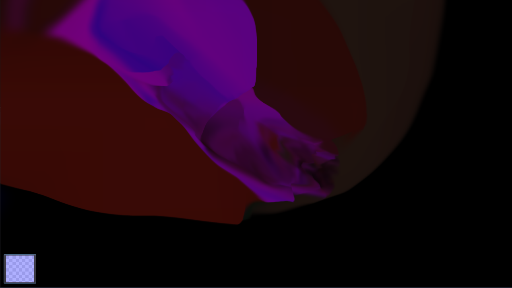

# NavierStokes
Simplistic simulator of Navier Stokes equations for fluid dynamics.

## Credits

This is a simplified version of the more powerful [2D Fluid Simulation](https://github.com/Maaack/2D-Fluid-Simulation). It uses its general structure, including some of its shaders. Additionally, it also uses the brush soft asset,  and the  Godot Scene setup with viewports (though heavily modified and simplified).
